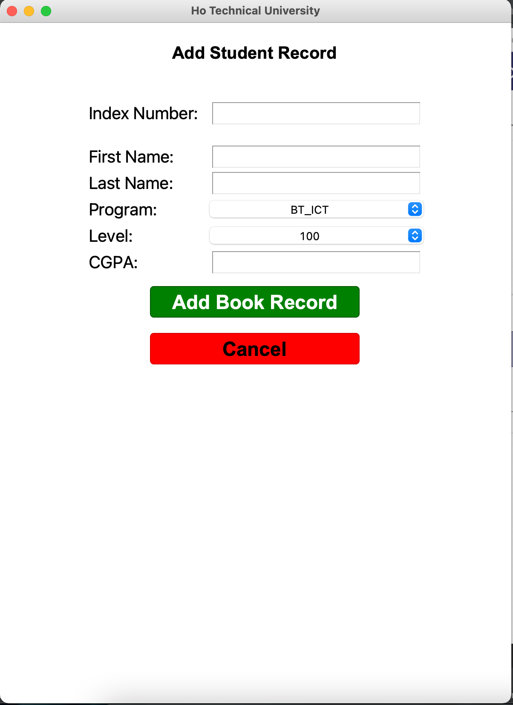

# Python Student Database Management System

This project is a simple python project that follows OOP to create a basic data management 
system. 

## Screens
- Login
- Management console
    - Student Data Screen
    - Assesment Screen
    - Reports Screen

## Workflow
 An admin logs in to the console and is privy to all data available, the admin can make CRUD changes to all data.  
 An admin can import data from .txt and .csv files 

### Credentials
admin: st_001  
pass: 12345

### Database
import students.sql and change the user credentials in the DBCon.py class

## Demo
- ### login

- ### Management Console: Student Data

- ### data addition

- ### data import screen

- ### Reports screen

## Group Members
 - Klidza Richmond- 0320080210
 - Salem Mercy Glory- 0320080142
 - Eugene Sewor Emmanuel - 0320080070
 - Feyi Rebecca Ernestina - 0320080080
 - Grace Ansah-Addo - 0320080111
 - Nuhu Manav
 - Tuglo Emmanuella - 0320080242
 - Elizabeth Nutor - 0320080167
